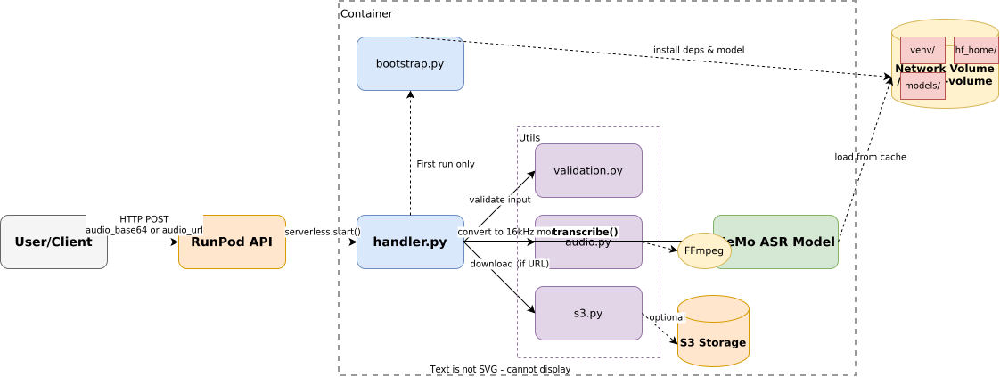
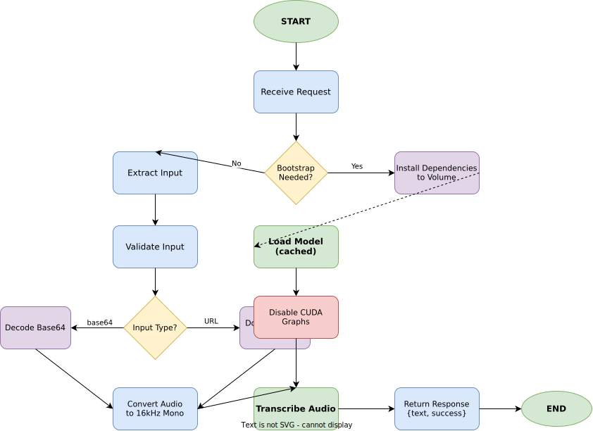

# Parakeet RunPod Serverless

[](https://opensource.org/licenses/MIT)
[](https://www.python.org/downloads/)
[](https://developer.nvidia.com/cuda-toolkit)
[](https://runpod.io)

> Production-ready serverless speech-to-text API powered by NVIDIA's Parakeet TDT 0.6B v3 model.

Deploy high-accuracy multilingual transcription on RunPod with automatic scaling, persistent model caching, and support for both Base64 and S3 URL inputs. Optimized for fast warm starts and cost-effective serverless inference.

## ✨ Features

- **25 European Languages** - Automatic language detection with support for Bulgarian, Croatian, Czech, Danish, Dutch, English, Estonian, Finnish, French, German, Greek, Hungarian, Italian, Latvian, Lithuanian, Maltese, Polish, Portuguese, Romanian, Slovak, Slovenian, Spanish, Swedish, Russian, and Ukrainian
- **Multiple Audio Formats** - Accepts .m4a, .ogg, .opus, .wav, .mp3, .flac with automatic conversion to optimal format
- **Flexible Input Methods** - Base64 encoded audio or S3 pre-signed URLs for seamless integration
- **Optional Timestamps** - Word, segment, and character-level timestamps for precise alignment
- **Long Audio Support** - Handles up to 3 hours of audio with intelligent attention model switching
- **Smart Caching** - Network-attached volume storage for instant warm starts after first deployment
- **Automatic Formatting** - Built-in punctuation, capitalization, and text normalization

## 🏗️ Architecture



The system uses a **volume-based persistent installation** strategy where all heavy dependencies (PyTorch, NeMo, model weights) are installed once to a network-attached volume and reused across container instances. This enables:

- **Fast warm starts** (~2 seconds) after initial bootstrap
- **Cost efficiency** through shared volume across instances
- **Automatic dependency management** via NeMo toolkit
- **CUDA graph optimization disabled** for stability across GPU types

### Component Overview

| Component | Purpose |
|-----------|---------|
| `handler.py` | Main entry point, coordinates request processing and model inference |
| `bootstrap.py` | First-run installation orchestration, creates venv and downloads model |
| `config.py` | Centralized configuration (paths, model settings, thresholds) |
| `utils/validation.py` | Input validation, Base64 decoding, format checking |
| `utils/audio.py` | FFmpeg-based audio conversion to 16kHz mono WAV/FLAC |
| `utils/s3.py` | S3 pre-signed URL downloads with timeout handling |

## 🚀 Quick Start

### Prerequisites

- RunPod account with GPU access
- GitHub repository connected to RunPod
- Network-attached volume (minimum 20GB)
- GPU with 24GB+ VRAM (A10G, A6000, A40, A100)

### Deployment

1. **Connect Repository to RunPod**
   ```
   RunPod Dashboard → Serverless → My Endpoints → New Endpoint
   - Source: GitHub (connect sruckh/parakeet-runpod)
   - Branch: main
   ```

2. **Configure GPU Settings**
   ```
   GPU Type: NVIDIA A6000 (48GB) - Recommended
   Min Workers: 0 (auto-scale from zero)
   Max Workers: 3 (adjust based on load)
   ```

3. **Configure Volume**
   ```
   Volume Name: parakeet-models
   Mount Path: /runpod-volume
   Size: 20GB minimum
   ```

4. **Deploy**
   - RunPod automatically builds the container from the Dockerfile
   - First request triggers bootstrap (5-15 minutes)
   - Subsequent requests start in ~2 seconds

### First Request Bootstrap

The initial request installs all dependencies to the volume:

```
Creating directories...                     ✓ 1s
Creating Python 3.11 virtual environment... ✓ 10s
Installing NeMo toolkit...                  ✓ 5-10 min
Installing HuggingFace Hub...               ✓ 30s
Installing additional dependencies...       ✓ 20s
Downloading Parakeet model (~2GB)...        ✓ 2-5 min
Creating installation marker...             ✓ 1s

Total: ~5-15 minutes (one-time only)
```

See [Bootstrap Workflow](./docs/diagrams/bootstrap-workflow.svg) for detailed timing.

## 📖 API Documentation

### Request Format

Send requests to your RunPod endpoint:

```bash
curl -X POST https://api.runpod.ai/v2/YOUR_ENDPOINT_ID/runsync \
  -H "Authorization: Bearer YOUR_API_KEY" \
  -H "Content-Type: application/json" \
  -d @payload.json
```

### Input Schemas

#### Base64 Audio Input

```json
{
  "input": {
    "audio_base64": "UklGRiQAAABXQVZFZm10...",
    "timestamps": false
  }
}
```

#### S3 Pre-signed URL Input

```json
{
  "input": {
    "audio_url": "https://s3.amazonaws.com/bucket/audio.mp3?presigned=...",
    "timestamps": false
  }
}
```

#### With Timestamps Enabled

```json
{
  "input": {
    "audio_base64": "UklGRiQAAABXQVZFZm10...",
    "timestamps": true
  }
}
```

> **Note:** The API accepts either `timestamps` or `timestamp` as the key.

### Response Format

#### Success Response (Without Timestamps)

```json
{
  "text": "This is the transcribed text with automatic punctuation and capitalization.",
  "success": true
}
```

#### Success Response (With Timestamps)

```json
{
  "text": "This is the transcribed text.",
  "timestamps": {
    "word": [
      {"start": 0.0, "end": 0.25, "text": "This"},
      {"start": 0.25, "end": 0.4, "text": "is"},
      {"start": 0.4, "end": 0.55, "text": "the"}
    ],
    "segment": [
      {"start": 0.0, "end": 2.5, "segment": "This is the transcribed text."}
    ]
  },
  "success": true
}
```

#### Error Response

```json
{
  "error": "Invalid input: audio_base64 must be a string, got list",
  "success": false
}
```

### Supported Audio Formats

| Format | Extension | Notes |
|--------|-----------|-------|
| WAV | `.wav` | Native format (no conversion) |
| FLAC | `.flac` | Lossless compression |
| MP3 | `.mp3` | Lossy compression, widely supported |
| OGG | `.ogg` | Ogg Vorbis codec |
| Opus | `.opus` | Low-latency codec |
| M4A | `.m4a` | AAC audio container |

All formats are automatically converted to **16kHz mono WAV** before transcription.

## ⚙️ Configuration

### Environment Variables

| Variable | Description | Required | Default |
|----------|-------------|----------|---------|
| `S3_ACCESS_KEY` | AWS S3 access key for direct downloads | No | - |
| `S3_SECRET_KEY` | AWS S3 secret key | No | - |
| `S3_ENDPOINT` | Custom S3 endpoint (for S3-compatible services) | No | - |
| `S3_BUCKET` | Default S3 bucket name | No | - |

### GPU Requirements

| GPU Model | VRAM | Support | Notes |
|-----------|------|---------|-------|
| NVIDIA A6000 | 48GB | ✅ Primary | Best performance-to-cost ratio |
| NVIDIA A40 | 48GB | ✅ Recommended | Enterprise-grade reliability |
| NVIDIA A100 | 40/80GB | ✅ Recommended | Highest performance |
| NVIDIA A10G | 24GB | ✅ Minimum | Budget option |
| NVIDIA RTX 6000 Ada | 48GB | ✅ Recommended | Latest architecture |
| NVIDIA L40S | 48GB | ✅ Recommended | AI-optimized |

### Audio Duration Limits

| Duration | Attention Mode | Context Size | Performance |
|----------|----------------|--------------|-------------|
| 0-24 min | Full Attention | N/A | Optimal accuracy |
| 24 min - 3 hr | Local Attention | 256L / 256R | High accuracy, longer processing |
| > 3 hr | Not Supported | - | Split into chunks |

## 📊 Data Flow



The request processing follows this pipeline:

1. **Input Validation** - Verify audio_base64 or audio_url format
2. **Audio Acquisition** - Decode Base64 or download from S3
3. **Audio Conversion** - FFmpeg conversion to 16kHz mono WAV
4. **Model Loading** - Load cached NeMo model (disabled CUDA graphs)
5. **Transcription** - Run inference with attention model selection
6. **Response** - Return JSON with text and optional timestamps

## 🧪 Testing

### Local Testing (Optional)

Build and test the container locally before deploying:

```bash
# Build container
docker build -t parakeet-test .

# Run with GPU and volume mount
docker run -v $(pwd)/test-volume:/runpod-volume \
  --gpus all \
  -e NVIDIA_VISIBLE_DEVICES=all \
  parakeet-test

# Check bootstrap status
docker run -v $(pwd)/test-volume:/runpod-volume \
  --entrypoint python3 \
  parakeet-test /app/bootstrap.py --check
```

### Syntax Validation

```bash
# Validate Python syntax before pushing
python3 -m py_compile *.py utils/*.py tests/*.py
```

### Unit Tests

```bash
# Run test suite
pytest tests/ -v

# Run specific test file
pytest tests/test_audio.py -v

# Run with coverage
pytest --cov=utils --cov=handler tests/
```

## 📁 Project Structure

```
parakeet-runpod/
├── Dockerfile              # Container build (CUDA 12.4.1, Python 3.11)
├── handler.py              # RunPod serverless entry point
├── bootstrap.py            # Volume installation orchestration
├── config.py               # Configuration constants
├── requirements.txt        # Dependency reference (installed to venv)
│
├── utils/                  # Utility modules
│   ├── __init__.py
│   ├── audio.py            # FFmpeg audio conversion
│   ├── s3.py               # S3 pre-signed URL downloads
│   └── validation.py       # Input validation and Base64 decoding
│
├── tests/                  # Unit tests
│   ├── __init__.py
│   ├── test_audio.py       # Audio conversion tests
│   └── test_handler.py     # Handler flow tests
│
└── docs/
    └── diagrams/           # Architecture diagrams
        ├── architecture.drawio
        ├── data-flow.drawio
        └── bootstrap-workflow.drawio
```

## 🔧 Development

### Code Style

This project follows Google-style Python conventions:

```python
# Type hints required
def transcribe_audio(audio_path: str, include_timestamps: bool = False) -> dict[str, Any]:
    """
    Transcribe audio file using Parakeet model.

    Args:
        audio_path: Path to 16kHz mono audio file
        include_timestamps: Whether to include word/segment timestamps

    Returns:
        Dict with 'text' and optional 'timestamps' keys

    Raises:
        RuntimeError: If transcription fails
    """
```

### Import Order

```python
# 1. Standard library
import os
import sys
from pathlib import Path

# 2. Third-party
import torch
import nemo.collections.asr as nemo_asr

# 3. Local
import config
from utils.audio import convert_audio_for_parakeet
```

### Making Changes

1. **Edit code** - Make changes locally
2. **Test syntax** - `python3 -m py_compile *.py`
3. **Push to GitHub** - `git push origin main`
4. **RunPod auto-builds** - Container rebuilds automatically
5. **Check logs** - View bootstrap.log from VM for debugging

### Debugging Bootstrap Issues

Bootstrap logs are written to the volume for debugging:

```bash
# From VM with mounted volume at /workspace
cat /workspace/Parakeet/bootstrap.log

# Look for errors
grep ERROR /workspace/Parakeet/bootstrap.log

# Check installation status
ls -la /workspace/Parakeet/
# Should see: venv/ hf_home/ hf_hub/ .installation_complete
```

## 🤝 Contributing

Contributions are welcome! This project uses:

- **Python 3.11** (installed via deadsnakes PPA)
- **CUDA 12.4.1** (base image: nvidia/cuda:12.4.1-cudnn-devel-ubuntu22.04)
- **NeMo toolkit** (auto-installs compatible PyTorch)
- **Google-style docstrings** and type hints

### Contribution Workflow

1. Fork the repository
2. Create a feature branch (`git checkout -b feature/amazing-feature`)
3. Make changes following code style guidelines
4. Test locally with Docker (optional)
5. Commit changes (`git commit -m 'Add amazing feature'`)
6. Push to branch (`git push origin feature/amazing-feature`)
7. Open a Pull Request

## 🐛 Known Issues & Solutions

### Issue: CUDA Error 35 During Transcription

**Symptom**: `Exception: CUDA failure! 35` in NeMo CUDA graph compilation

**Solution**: CUDA graphs are explicitly disabled in `handler.py` line 153:
```python
asr_model.decoding.decoding.decoding_computer.disable_cuda_graphs()
```

This trades ~10-15% performance for stability across GPU types.

### Issue: Bootstrap Fails with Python 3.10 venv Error

**Symptom**: `apt install python3.10-venv` message during bootstrap

**Solution**: Fixed in Dockerfile line 49 - uses `update-alternatives` to make python3 point to python3.11

### Issue: First Request Times Out

**Symptom**: Request timeout after 30 seconds on first run

**Solution**: Increase RunPod timeout to 900 seconds (15 minutes) for first request. Subsequent requests complete in seconds.

## 📄 License

This project is licensed under the MIT License - see [LICENSE](LICENSE) for details.

## 🙏 Acknowledgments

- **NVIDIA** - For the [Parakeet TDT 0.6B v3](https://huggingface.co/nvidia/parakeet-tdt-0.6b-v3) model and NeMo toolkit
- **RunPod** - For serverless GPU infrastructure
- **HuggingFace** - For model hosting and distribution

## 📞 Support

- **Issues**: [GitHub Issues](https://github.com/sruckh/parakeet-runpod/issues)
- **Discussions**: [GitHub Discussions](https://github.com/sruckh/parakeet-runpod/discussions)
- **Documentation**: See `CLAUDE.md` for development guidelines

## 🔗 Related Resources

- [NVIDIA NeMo Toolkit](https://github.com/NVIDIA/NeMo)
- [Parakeet Model Card](https://huggingface.co/nvidia/parakeet-tdt-0.6b-v3)
- [RunPod Documentation](https://docs.runpod.io/)
- [FFmpeg Audio Processing](https://ffmpeg.org/ffmpeg-filters.html#Audio-Filters)

---

**Built with ❤️ for production-grade speech-to-text inference**
